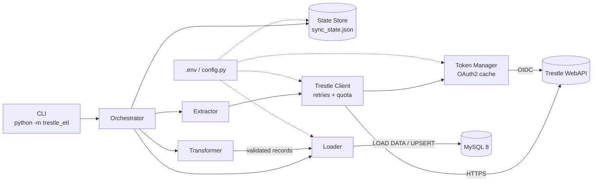
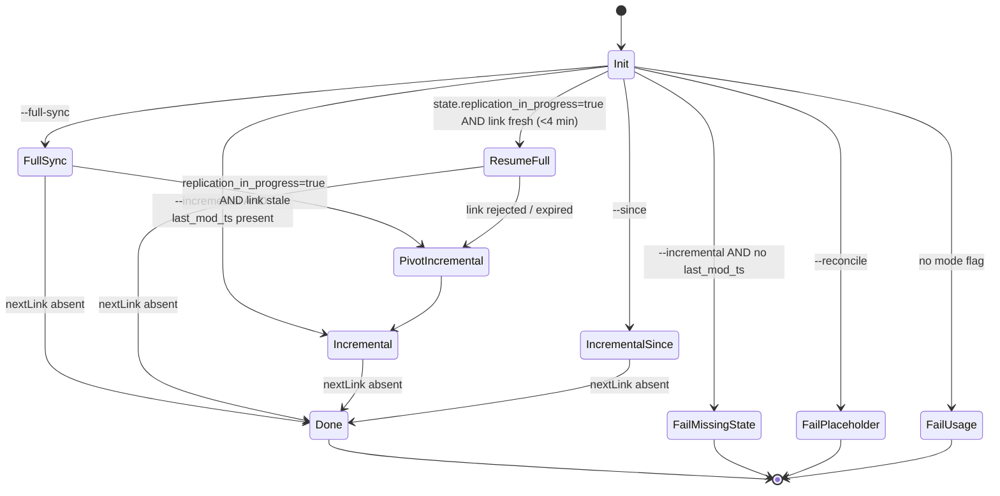

# Design Document

## Overview

The Trestle ETL Pipeline is a single-process Python application that extracts Property records from Cotality's Trestle WebAPI (OData v4 over the RESO Data Dictionary), validates and normalizes them with Pydantic v2, and persists them into a local MySQL 8 database. The pipeline runs in one of two modes selected by the CLI:

- **Full sync** — drives the Trestle replication endpoint (`?replication=true`) so it can move the ~1.6 M Property records that exceed the 1,000,000-record `$top/$skip` ceiling. Uses a bulk-load path (`LOAD DATA LOCAL INFILE`) for throughput.
- **Incremental sync** — drives the standard `/Property` endpoint with `$filter=ModificationTimestamp gt <ts>` and writes via `INSERT … ON DUPLICATE KEY UPDATE` batches for idempotence.

State is persisted to a local JSON file (`sync_state.json`) after every committed batch. The pipeline handles SIGINT by finishing the in-flight batch before exiting, guaranteeing that `sync_state.last_modification_timestamp` never references uncommitted data (Requirement 15).

The design prioritizes three properties, in order:

1. **Correctness under crash** — the state file must never point past committed data, and restarts must never skip or duplicate records.
2. **Restartability** — long-running full syncs must be resumable either from a saved replication link or, if the link has expired, via a pivot to incremental sync.
3. **Throughput for the initial backfill** — the bulk-load path must be fast enough that 1.6 M records is a feasible single-machine operation.

### Research Notes

A few key facts from the Trestle documentation shaped the design:

- **Replication link lifetime** — `@odata.nextLink` URLs returned by the replication endpoint expire after **5 minutes of inactivity** and cannot be skipped. This forces the extractor to stream pages one at a time and couple the fetch rhythm to the load rhythm (Requirement 3.4, 3.5). The resume logic uses a 4-minute cutoff (Requirement 3.8) to stay inside that window with margin.
- **OData `$top/$skip` cap** — Trestle caps paginated offsets at 1,000,000 records; the replication endpoint is the documented workaround. This is why full sync cannot simply use `$top/$skip` against `/Property`.
- **Quota headers** — `Retry-After` and `Hour-Quota-Available` are documented response headers that must be honored (Requirements 2.1, 2.7). `Retry-After` takes precedence; exponential backoff (1, 2, 4, 8, 16, 32 s) only applies when `Retry-After` is absent.
- **`PrettyEnums`** — Trestle can return enum values as either canonical PascalCase or human-friendly strings. We deliberately do not rely on `PrettyEnums=true`; the RESO Data Dictionary defines the canonical PascalCase values and those are what we store (Requirement 5.4).
- **`LOAD DATA LOCAL INFILE`** — requires `local_infile=1` on the MySQL server and `local_infile=True` on the client connection. PyMySQL exposes this as a connection parameter.
- **Multi-select enums** — RESO permits multi-select enumeration fields to be serialized as comma-separated strings. Rather than attempt a canonical split-and-reassemble, the Transformer preserves the raw string in `raw_data` (Requirement 5.3) and only promotes unambiguous single-value fields to typed columns.

## Architecture

### High-Level Component Diagram



### Data Flow Per Batch

```mermaid
sequenceDiagram
    participant Orch as Orchestrator
    participant Ext as Extractor
    participant Cli as TrestleClient
    participant Trans as Transformer
    participant Load as Loader
    participant State as StateStore
    participant DB as MySQL

    Orch->>Ext: next page
    Ext->>Cli: GET (initial URL or nextLink)
    Cli-->>Ext: page JSON + nextLink
    Ext-->>Orch: page records + nextLink
    Orch->>Trans: validate(page)
    Trans-->>Orch: (promoted_cols, raw_data) per record
    Orch->>Load: write_batch(records)
    Load->>DB: BEGIN; LOAD DATA … OR UPSERT …
    Load->>DB: COMMIT
    Load-->>Orch: batch_size, max_mod_ts
    Orch->>State: update(last_mod_ts, nextLink, in_progress)
    State->>State: atomic rename tmp -> sync_state.json
    Orch->>Ext: continue (or stop if SIGINT)
```

### Pipeline State Machine



### Process Model

Single Python process, single thread for extract-transform-load. Network I/O, disk I/O, and database I/O are all synchronous. Concurrency would complicate the replication-link lifetime and transactional state update guarantees; given the single-developer, single-machine scope in the requirements, the synchronous design is the right trade-off.

## Components and Interfaces

### Module Layout

```
trestle_etl/
├── __main__.py          # python -m trestle_etl entry point
├── cli.py               # argparse CLI, dispatches to orchestrator
├── config.py            # env-var loading, Settings dataclass
├── orchestrator.py      # top-level run loop, mode selection, SIGINT handling
├── auth.py              # TokenManager
├── http_client.py       # TrestleClient (retries, quota, 401 retry)
├── extractor.py         # replication_stream, incremental_stream
├── models.py            # Pydantic v2 Property model
├── transformer.py       # validate() and to_row() functions
├── loader/
│   ├── __init__.py
│   ├── upsert.py        # UpsertLoader
│   └── bulk.py          # BulkLoader (CSV + LOAD DATA LOCAL INFILE)
├── state.py             # StateStore (atomic JSON persist)
├── logging_setup.py     # structured logging config
└── sql/
    └── schema.sql       # property table DDL
```

### `config.Settings`

```python
@dataclass(frozen=True)
class Settings:
    trestle_base_url: str           # env: TRESTLE_BASE_URL
    trestle_token_url: str          # env: TRESTLE_TOKEN_URL
    client_id: str                  # env: TRESTLE_CLIENT_ID
    client_secret: str              # env: TRESTLE_CLIENT_SECRET
    mysql_host: str                 # env: MYSQL_HOST
    mysql_port: int                 # env: MYSQL_PORT (default 3306)
    mysql_user: str                 # env: MYSQL_USER
    mysql_password: str             # env: MYSQL_PASSWORD
    mysql_database: str             # env: MYSQL_DATABASE
    state_file_path: Path           # env: STATE_FILE_PATH (default sync_state.json)
    default_page_size: int          # env: PAGE_SIZE (default 1000)

    @classmethod
    def load(cls) -> "Settings": ...    # reads .env via python-dotenv, raises on missing
```

### `auth.TokenManager`

Caches an OAuth2 bearer token and a monotonic expiration timestamp. Interface:

```python
class TokenManager:
    def __init__(self, settings: Settings, http: requests.Session): ...
    def get_token(self) -> str:
        """Return a valid bearer token, fetching a new one if cached token
        has ≤ 60 s of remaining validity. Raises ConfigError if credentials missing."""
    def invalidate(self) -> None:
        """Drop the cached token. Called by TrestleClient on 401."""
```

Caching uses `time.monotonic()` plus the `expires_in` value from the token response, minus a 60-second safety margin (Requirement 1.5).

### `http_client.TrestleClient`

Wraps `requests.Session` and centralizes retry, quota, and authentication behavior.

```python
class TrestleClient:
    def __init__(self, settings: Settings, token_mgr: TokenManager): ...

    def get(self, url: str, params: dict | None = None) -> dict:
        """GET a JSON resource. Attaches Bearer token, handles 401 re-auth (one shot),
        429/5xx retry budget (6 total per request), logs Hour-Quota-Available."""
```

Retry logic:

| Response | Behavior |
|---|---|
| 200 | Return parsed JSON. Log `Hour-Quota-Available` header value if present. |
| 401 | Invalidate token, re-auth, retry **once**. Not counted against the retry budget (Requirement 2.8). |
| 429 | Wait `Retry-After` seconds if header present; otherwise use backoff table `[1, 2, 4, 8, 16, 32]` indexed by attempt. Counts against budget. |
| 504 | Use the same backoff table. Counts against budget. |
| Other 5xx | Use the same backoff table. Counts against budget. |
| Other 4xx | Raise immediately; not retried. |
| After 6 retries exhausted | Raise `TrestleHTTPError(status, body_excerpt, url)` (Requirement 2.6). |

### `extractor`

Two generator functions, both yielding `(records: list[dict], next_link: str | None)` tuples page-by-page:

```python
def replication_stream(
    client: TrestleClient,
    settings: Settings,
    resume_from: str | None = None,
) -> Iterator[tuple[list[dict], str | None]]:
    """Yield pages from GET /Property?replication=true&$orderby=ModificationTimestamp asc&$top=1000.
    If resume_from is provided, the first request uses that URL verbatim; otherwise uses the
    initial replication URL. Terminates when a page has no @odata.nextLink."""

def incremental_stream(
    client: TrestleClient,
    settings: Settings,
    since: datetime,
) -> Iterator[tuple[list[dict], str | None]]:
    """Yield pages from GET /Property?$filter=ModificationTimestamp gt <since>&
    $orderby=ModificationTimestamp asc&$top=1000, following @odata.nextLink."""
```

Both generators are lazy; the orchestrator pulls one page, loads it, updates state, and only then asks for the next page. This is what keeps the replication link fresh (Requirement 3.4, 3.5) and gives us the batch-commit boundary that Requirement 15 relies on.

### `models.Property` (Pydantic v2)

```python
class Property(BaseModel):
    model_config = ConfigDict(extra="allow")   # unknown RESO fields retained on the model

    ListingKey: str = Field(max_length=128)
    ListingId: str | None = None
    MlsStatus: str | None = None
    # ... all Promoted_Columns fields (see Data Models section)
```

`extra="allow"` ensures unknown fields are kept on the model (supporting Requirement 14.4 in-model), but the canonical unknown-field retention is via `raw_data` (the Transformer always captures the original dict before validation).

### `transformer`

Pure functions, no I/O:

```python
def validate(raw: dict) -> Property | None:
    """Parse raw JSON dict into a Property model. Returns None and logs WARNING if
    ListingKey is missing (Requirement 5.6). Fields absent from raw are treated as
    None (Requirement 5.2). Timestamps parsed as UTC (Requirement 5.7)."""

def to_row(raw: dict, model: Property) -> Row:
    """Produce a (promoted_columns_tuple, raw_data_json_str) pair. raw_data is the
    ORIGINAL unmodified dict serialized to JSON (Requirement 5.5, 14.4), not the
    round-tripped model."""
```

**Key invariant:** `to_row` uses the *original* `raw` dict for `raw_data`, not `model.model_dump()`. This guarantees that unknown RESO fields survive end-to-end even if the Pydantic model lags behind a schema change (Requirement 14.4).

### `loader` — two interchangeable strategies

Both loaders implement a common interface:

```python
class Loader(Protocol):
    def write_batch(self, rows: list[Row]) -> BatchResult: ...
    def close(self) -> None: ...

@dataclass
class BatchResult:
    count: int
    max_modification_timestamp: datetime
```

#### `UpsertLoader`

- SQLAlchemy Core (not ORM) + `pymysql` driver (Requirement 7.7).
- Each batch is one transaction wrapping one `INSERT … ON DUPLICATE KEY UPDATE` statement (parameterized with `executemany`).
- Batch size defaults to 1,000; capped at 5,000 (Requirement 7.2).
- On commit success: returns `BatchResult` to orchestrator.
- On commit failure: rollback, re-raise; orchestrator does not update state (Requirement 7.4, 9.4).

The upsert statement is built dynamically from the Promoted_Columns list so that adding a promoted field is a one-place schema change.

#### `BulkLoader`

- On construction (at the start of `--full-sync`), drops all secondary indexes listed in Requirement 6.5. Primary key is preserved (Requirement 8.7).
- For each batch: writes a CSV to `tempfile.mkdtemp()`, then runs `LOAD DATA LOCAL INFILE '<path>' REPLACE INTO TABLE property CHARACTER SET utf8mb4 FIELDS TERMINATED BY ',' ENCLOSED BY '"' ESCAPED BY '\\' LINES TERMINATED BY '\n' (column_list)`.
- After successful load: deletes the CSV file (Requirement 8.4).
- On `close()`: recreates the dropped indexes (Requirement 8.7).
- On startup when `replication_in_progress=true`: verifies all secondary indexes exist and recreates any missing ones before proceeding (Requirement 8.8). This covers the case where a prior run was killed mid-bulk-load and never had a chance to restore indexes.

`REPLACE INTO` rather than `INSERT INTO` is used so that re-running a page (for example after an aborted resume) is idempotent on the primary key.

`LOAD DATA LOCAL INFILE` configuration error handling (Requirement 8.6): if PyMySQL reports that `local_infile` is not enabled, the loader raises `BulkLoadConfigError("MySQL server must be started with local_infile=1 and client must set local_infile=True")` before consuming any more pages.

### `state.StateStore`

```python
@dataclass
class SyncState:
    last_modification_timestamp: datetime | None
    replication_in_progress: bool
    replication_next_link: str | None
    replication_next_link_persisted_at: datetime | None  # for the 4-minute freshness check

class StateStore:
    def __init__(self, path: Path): ...
    def load(self) -> SyncState:
        """Returns default state if file missing. Raises CorruptStateError if file
        present but unparseable (Requirement 9.8)."""
    def save(self, state: SyncState) -> None:
        """Atomic write: write to <path>.tmp, fsync, rename over <path> (Requirement 9.6)."""
```

The `replication_next_link_persisted_at` field is added on top of Requirement 9.2's required fields so that the "link fresh within 4 minutes" check in Requirement 3.8 is decidable from the file alone. It is written on every state save that touches `replication_next_link`.

### `orchestrator`

The orchestrator is the only component that knows which mode is running and is the sole writer of `StateStore`. A simplified loop for a full sync:

```python
def run_full_sync(deps: Deps) -> None:
    state = deps.state_store.load()

    if state.replication_in_progress and _link_is_fresh(state):
        log.info("Resuming replication from saved nextLink")
        stream = deps.extractor.replication_stream(resume_from=state.replication_next_link)
    elif state.replication_in_progress:
        log.warning("Saved replication link is stale; pivoting to incremental")
        return run_incremental(deps, since=state.last_modification_timestamp)
    else:
        stream = deps.extractor.replication_stream()

    deps.bulk_loader.ensure_indexes_if_resuming(state)  # Requirement 8.8
    deps.bulk_loader.drop_secondary_indexes_if_fresh_full_sync(state)

    try:
        for page, next_link in stream:
            rows = [r for r in (deps.transformer.to_row_safe(rec) for rec in page) if r]
            result = deps.bulk_loader.write_batch(rows)
            new_state = SyncState(
                last_modification_timestamp=max(state.last_modification_timestamp or MIN,
                                                result.max_modification_timestamp),
                replication_in_progress=(next_link is not None),
                replication_next_link=next_link,
                replication_next_link_persisted_at=datetime.now(UTC) if next_link else None,
            )
            deps.state_store.save(new_state)
            state = new_state
            if _sigint_received():
                log.info("SIGINT received; exiting gracefully after current batch")
                return
    finally:
        deps.bulk_loader.close()   # recreates indexes
```

SIGINT handling (Requirement 10): a module-level `_sigint_received` flag is set by the `signal.SIGINT` handler. The handler also installs a second handler that `sys.exit(130)`s immediately on the second signal (Requirement 10.4).

## Data Models

### Pydantic `Property` Model (Transformer)

Fields correspond one-to-one with Promoted_Columns. Only listed fields are typed; `extra="allow"` keeps unknown RESO fields on the model.

| Field | Python type | Notes |
|---|---|---|
| `ListingKey` | `str` (≤128) | Required, non-empty; primary key |
| `ListingId` | `str \| None` | MLS-facing listing identifier |
| `MlsStatus` | `str \| None` | |
| `InternetEntireListingDisplayYN` | `bool \| None` | |
| `InternetAddressDisplayYN` | `bool \| None` | |
| `InternetAutomatedValuationDisplayYN` | `bool \| None` | |
| `InternetConsumerCommentYN` | `bool \| None` | |
| `Latitude` | `Decimal \| None` | |
| `Longitude` | `Decimal \| None` | |
| `ParcelNumber` | `str \| None` | |
| `StreetNumberNumeric` | `int \| None` | |
| `StreetDirPrefix` | `str \| None` | |
| `StreetName` | `str \| None` | |
| `StreetSuffix` | `str \| None` | |
| `UnitNumber` | `str \| None` | |
| `City` | `str \| None` | |
| `StateOrProvince` | `str \| None` | |
| `PostalCode` | `str \| None` | |
| `OriginalListPrice` | `Decimal \| None` | |
| `ListPrice` | `Decimal \| None` | |
| `ClosePrice` | `Decimal \| None` | |
| `ModificationTimestamp` | `datetime \| None` | Parsed as UTC |
| `OriginalEntryTimestamp` | `datetime \| None` | Parsed as UTC |
| `PendingTimestamp` | `datetime \| None` | Parsed as UTC |
| `StatusChangeTimestamp` | `datetime \| None` | Parsed as UTC |
| `WithdrawnDate` | `date \| None` | |
| `CloseDate` | `date \| None` | |
| `PhotosChangeTimestamp` | `datetime \| None` | Parsed as UTC |
| `PhotosCount` | `int \| None` | |
| `VideosCount` | `int \| None` | |
| `PropertyType` | `str \| None` | Canonical PascalCase |
| `PropertySubType` | `str \| None` | |
| `PropertySubTypeAdditional` | `str \| None` | |
| `StructureType` | `str \| None` | Possible multi-select; raw string preserved |
| `YearBuiltDetails` | `str \| None` | |
| `ArchitecturalStyle` | `str \| None` | Possible multi-select; raw string preserved |
| `PropertyAttachedYN` | `bool \| None` | |
| `Stories` | `int \| None` | |
| `LivingArea` | `Decimal \| None` | |
| `LotSizeSquareFeet` | `Decimal \| None` | |
| `BedroomsTotal` | `int \| None` | |
| `BathroomsFull` | `int \| None` | |
| `BathroomsHalf` | `int \| None` | |
| `BathroomsThreeQuarter` | `int \| None` | |
| `GarageSpaces` | `Decimal \| None` | May be fractional |
| `YearBuilt` | `int \| None` | |
| `YearBuiltEffective` | `int \| None` | |
| `PoolPrivateYN` | `bool \| None` | |
| `SpaYN` | `bool \| None` | |
| `DirectionFaces` | `str \| None` | |
| `SeniorCommunityYN` | `bool \| None` | |
| `AssociationYN` | `bool \| None` | |
| `AssociationAmenities` | `str \| None` | Multi-select; raw string preserved |
| `HorseAmenities` | `str \| None` | Multi-select; raw string preserved |
| `PetsAllowedYN` | `bool \| None` | |
| `Furnished` | `str \| None` | |
| `ListAgentKey` | `str \| None` | |
| `ListOfficeKey` | `str \| None` | |
| `ListTeamKey` | `str \| None` | |
| `BuyerAgentKey` | `str \| None` | |
| `BuyerOfficeKey` | `str \| None` | |
| `BuyerTeamKey` | `str \| None` | |

### MySQL `property` Table Schema

```sql
CREATE TABLE property (
    ListingKey                              VARCHAR(128) NOT NULL PRIMARY KEY,
    ListingId                               VARCHAR(128) NULL,
    MlsStatus                               VARCHAR(64) NULL,
    InternetEntireListingDisplayYN          TINYINT(1) NULL,
    InternetAddressDisplayYN                TINYINT(1) NULL,
    InternetAutomatedValuationDisplayYN     TINYINT(1) NULL,
    InternetConsumerCommentYN               TINYINT(1) NULL,
    Latitude                                DECIMAL(10,7) NULL,
    Longitude                               DECIMAL(10,7) NULL,
    ParcelNumber                            VARCHAR(64) NULL,
    StreetNumberNumeric                     INT NULL,
    StreetDirPrefix                         VARCHAR(16) NULL,
    StreetName                              VARCHAR(128) NULL,
    StreetSuffix                            VARCHAR(32) NULL,
    UnitNumber                              VARCHAR(32) NULL,
    City                                    VARCHAR(64) NULL,
    StateOrProvince                         VARCHAR(2) NULL,
    PostalCode                              VARCHAR(16) NULL,
    OriginalListPrice                       DECIMAL(14,2) NULL,
    ListPrice                               DECIMAL(14,2) NULL,
    ClosePrice                              DECIMAL(14,2) NULL,
    ModificationTimestamp                   DATETIME(6) NULL,
    OriginalEntryTimestamp                  DATETIME(6) NULL,
    PendingTimestamp                        DATETIME(6) NULL,
    StatusChangeTimestamp                   DATETIME(6) NULL,
    WithdrawnDate                           DATE NULL,
    CloseDate                               DATE NULL,
    PhotosChangeTimestamp                   DATETIME(6) NULL,
    PhotosCount                             INT NULL,
    VideosCount                             INT NULL,
    PropertyType                            VARCHAR(64) NULL,
    PropertySubType                         VARCHAR(64) NULL,
    PropertySubTypeAdditional               VARCHAR(128) NULL,
    StructureType                           VARCHAR(128) NULL,
    YearBuiltDetails                        VARCHAR(128) NULL,
    ArchitecturalStyle                      VARCHAR(128) NULL,
    PropertyAttachedYN                      TINYINT(1) NULL,
    Stories                                 SMALLINT NULL,
    LivingArea                              DECIMAL(10,2) NULL,
    LotSizeSquareFeet                       DECIMAL(12,2) NULL,
    BedroomsTotal                           SMALLINT NULL,
    BathroomsFull                           SMALLINT NULL,
    BathroomsHalf                           SMALLINT NULL,
    BathroomsThreeQuarter                   SMALLINT NULL,
    GarageSpaces                            DECIMAL(6,2) NULL,
    YearBuilt                               SMALLINT NULL,
    YearBuiltEffective                      SMALLINT NULL,
    PoolPrivateYN                           TINYINT(1) NULL,
    SpaYN                                   TINYINT(1) NULL,
    DirectionFaces                          VARCHAR(32) NULL,
    SeniorCommunityYN                       TINYINT(1) NULL,
    AssociationYN                           TINYINT(1) NULL,
    AssociationAmenities                    VARCHAR(512) NULL,
    HorseAmenities                          VARCHAR(512) NULL,
    PetsAllowedYN                           TINYINT(1) NULL,
    Furnished                               VARCHAR(32) NULL,
    ListAgentKey                            VARCHAR(128) NULL,
    ListOfficeKey                           VARCHAR(128) NULL,
    ListTeamKey                             VARCHAR(128) NULL,
    BuyerAgentKey                           VARCHAR(128) NULL,
    BuyerOfficeKey                          VARCHAR(128) NULL,
    BuyerTeamKey                            VARCHAR(128) NULL,
    raw_data                                JSON NOT NULL,
    loaded_at                               DATETIME(6) NOT NULL
) ENGINE=InnoDB DEFAULT CHARSET=utf8mb4 COLLATE=utf8mb4_unicode_ci;

CREATE INDEX idx_property_modts      ON property(ModificationTimestamp);
CREATE INDEX idx_property_status     ON property(MlsStatus);
CREATE INDEX idx_property_type       ON property(PropertyType);
CREATE INDEX idx_property_city       ON property(City);
CREATE INDEX idx_property_postal     ON property(PostalCode);
CREATE INDEX idx_property_price      ON property(ListPrice);
CREATE INDEX idx_property_state      ON property(StateOrProvince);
```

`loaded_at` is `NOT NULL` without a `DEFAULT CURRENT_TIMESTAMP`; the Loader supplies the value at commit time per Requirement 6.7.

### State File Schema

```json
{
  "last_modification_timestamp": "2024-03-14T17:32:00.000000+00:00",
  "replication_in_progress": false,
  "replication_next_link": null,
  "replication_next_link_persisted_at": null
}
```

All timestamps are ISO 8601 with explicit `+00:00` offset. The loader/orchestrator always operates in UTC; local time never appears in the state file.


## Correctness Properties

*A property is a characteristic or behavior that should hold true across all valid executions of a system — essentially, a formal statement about what the system should do. Properties serve as the bridge between human-readable specifications and machine-verifiable correctness guarantees.*

The properties below are grouped by component. Each is universally quantified over the relevant input domain and is intended to be implemented as a single property-based test (minimum 100 iterations) tagged with its property number.

### Token and HTTP Client

#### Property 1: Retry-After is honored exactly

*For any* HTTP 429 response carrying a `Retry-After: n` header, the Trestle_Client SHALL wait at least `n` seconds (as measured via the injected sleep function) before issuing the retry.

**Validates: Requirements 2.1**

#### Property 2: Exponential backoff schedule

*For any* transient failure response (HTTP 429 without `Retry-After`, HTTP 504, or any other 5xx) at retry attempt `k` (0-indexed), the Trestle_Client SHALL delay by exactly `2^k` seconds before the next attempt, for `k ∈ {0, 1, 2, 3, 4, 5}`.

**Validates: Requirements 2.2, 2.3, 2.5**

#### Property 3: Shared retry budget of 6; 401 re-auth separate

*For any* sequence of transient failures (any interleaving of 429, 504, and other 5xx), the Trestle_Client SHALL raise `TrestleHTTPError` after exactly 6 retries; *and* inserting any number of HTTP 401 responses into the sequence SHALL NOT change the retry count before the error is raised (the one-shot 401 re-auth retry is not counted against the 6-retry budget).

**Validates: Requirements 2.4, 2.8**

#### Property 4: Every request carries a Bearer token

*For any* GET issued by the Trestle_Client against the Trestle API, the outgoing request SHALL include an `Authorization: Bearer <token>` header whose value equals the current TokenManager-cached token.

**Validates: Requirements 1.8**

#### Property 5: Token cache reuse window

*For any* `(issued_at, expires_in, current_time)` clock state, `TokenManager.get_token()` SHALL return the cached token without contacting the token endpoint iff `(issued_at + expires_in) − current_time > 60 s`; otherwise it SHALL fetch a fresh token.

**Validates: Requirements 1.4, 1.5**

### Extractor

#### Property 6: Streaming nextLink traversal with no buffering

*For any* finite chain of replication or incremental pages, the Extractor SHALL (a) issue a GET for every `@odata.nextLink` it observes, (b) terminate immediately when a page has no `@odata.nextLink`, and (c) yield each page to the consumer before issuing the GET for the following page (no buffering of multiple `@odata.nextLink` URLs).

**Validates: Requirements 3.2, 3.3, 3.4, 3.5, 4.4**

#### Property 7: `--since` override

*For any* State_Store value `s` and any CLI-supplied `--since` timestamp `t`, the first incremental request issued by the Extractor SHALL use `t` (not `s`) as the `ModificationTimestamp gt` filter lower bound.

**Validates: Requirements 4.3**

#### Property 8: Max-ModificationTimestamp reporting

*For any* sequence of Property records yielded by an incremental run, the `last_modification_timestamp` that the Extractor/Loader pipeline reports to the State_Store SHALL equal `max(record.ModificationTimestamp)` over every record observed in the run.

**Validates: Requirements 4.5**

### Full-Sync State and Resume

#### Property 9: Replication state invariant

*For any* sequence of committed pages during a full sync, after each batch commit the State_Store SHALL satisfy: `replication_in_progress = (next_link is not None)`, `replication_next_link` equals the `@odata.nextLink` of the just-committed page (or `null` if terminal), and `last_modification_timestamp` equals the max `ModificationTimestamp` observed across all batches committed so far.

**Validates: Requirements 3.6, 3.7, 9.5**

#### Property 10: Resume vs pivot on startup

*For any* State_Store with `replication_in_progress=true`, the orchestrator SHALL resume from `replication_next_link` iff `now − replication_next_link_persisted_at < 4 minutes`; otherwise it SHALL pivot to an incremental run starting from `last_modification_timestamp`.

**Validates: Requirements 3.8**

### Transformer

#### Property 11: Missing ListingKey skip

*For any* raw record dict, the Transformer SHALL produce a Row iff the record contains a non-empty `ListingKey` field; records without a `ListingKey` SHALL produce no Row and SHALL NOT raise.

**Validates: Requirements 5.6**

#### Property 12: Missing-field tolerance

*For any* raw record formed by starting from a valid record and removing any subset of fields other than `ListingKey`, the Transformer SHALL validate the record successfully and the resulting model SHALL have `None` for each removed field.

**Validates: Requirements 5.2**

#### Property 13: Pydantic round-trip

*For any* valid raw record, `parse(serialize(parse(record)))` SHALL produce a model instance equal to `parse(record)` (under Pydantic equality).

**Validates: Requirements 5.8, 14.2, 14.3**

#### Property 14: `raw_data` preservation

*For any* raw record dict (including arbitrary extra fields not present in the Pydantic model, multi-select enumeration strings, and comma-separated values), `json.loads(to_row(record).raw_data)` SHALL equal the input dict.

**Validates: Requirements 5.3, 5.5, 14.4**

#### Property 15: Timestamp UTC round-trip

*For any* timezone-aware `datetime`, serializing through the outbound OData filter and re-parsing the response timestamp SHALL yield a datetime representing the same UTC instant.

**Validates: Requirements 4.6, 5.7**

### Loader and Database

#### Property 16: `loaded_at` bounded by commit wall-clock

*For any* batch committed by the Loader with commit wall-clock time `t_commit`, every row in that batch SHALL have a `loaded_at` value satisfying `|loaded_at − t_commit| ≤ δ` for a small tolerance `δ` (milliseconds), and no row SHALL have a `loaded_at` value set by a MySQL `DEFAULT CURRENT_TIMESTAMP` clause.

**Validates: Requirements 6.7**

#### Property 17: Upsert idempotence

*For any* batch of Rows, applying the batch via the Upsert_Path twice SHALL produce the same final database state as applying it once.

**Validates: Requirements 7.6**

#### Property 18: Upsert batch-size bounds

*For any* input record stream processed by the Upsert_Path, every committed batch except possibly the final batch SHALL contain between 1,000 and 5,000 records (inclusive), and the final batch SHALL contain between 1 and 5,000 records.

**Validates: Requirements 7.2**

#### Property 19: Transactional rollback leaves state and DB unchanged

*For any* batch whose commit fails (simulated via an injected failure), both the `property` table and the `sync_state.json` file SHALL be byte-for-byte identical to their pre-batch state.

**Validates: Requirements 7.4, 9.4, 15.1**

#### Property 20: Bulk-load file lifecycle

*For any* replication page processed by the Bulk_Load_Path, the loader SHALL create exactly one temporary CSV file, invoke `LOAD DATA LOCAL INFILE` exactly once against that file, and delete the file after a successful load.

**Validates: Requirements 3.9, 8.2, 8.3, 8.4**

#### Property 21: Bulk-load index lifecycle

*For any* full-sync run that completes successfully, the set of secondary indexes on the `property` table before the run SHALL equal the set after the run; *and* during the run (between construction and close of the BulkLoader) none of the indexes listed in Requirement 6.5 SHALL exist on the table.

**Validates: Requirements 8.7**

#### Property 22: Startup index repair

*For any* state with `replication_in_progress=true` and any subset of the 7 required secondary indexes missing from the `property` table, the pipeline startup check SHALL recreate every missing index so that all 7 are present before extraction resumes.

**Validates: Requirements 8.8**

### State Persistence and Crash Recovery

#### Property 23: State file round-trip

*For any* `SyncState` value (including `None` fields, long `nextLink` URLs up to 2048 chars, and arbitrary UTC timestamps), `StateStore.load()` after `StateStore.save(s)` SHALL return a `SyncState` equal to `s`.

**Validates: Requirements 9.6 (atomicity), 9.1, 9.2**

#### Property 24: Crash-recovery invariant

*For any* simulated pipeline run (successful completion, exception during a batch, or SIGINT injected at an arbitrary point), the following invariants SHALL hold after the process exits: (a) `state.last_modification_timestamp` equals the maximum `ModificationTimestamp` across all batches whose transactions committed; (b) every record with `ModificationTimestamp ≤ state.last_modification_timestamp` observed during the run is present in the `property` table; (c) no record is present in the `property` table whose `ModificationTimestamp` is strictly greater than `state.last_modification_timestamp` among those not belonging to an already-committed batch.

**Validates: Requirements 15.2, 15.3, 10.1, 10.2**

### CLI

#### Property 25: `--dry-run` performs no side effects

*For any* mode flag combined with `--dry-run` and any input stream, the run SHALL issue zero writes to MySQL and SHALL NOT modify the State_File on disk.

**Validates: Requirements 11.3**

#### Property 26: CLI flag combination validation

*For any* subset of CLI flags drawn from `{--full-sync, --incremental, --reconcile, --dry-run, --since=<ts>}`, the CLI SHALL exit non-zero with a usage error iff the combination violates the documented rules (more than one of the three mode flags, or `--dry-run` with `--reconcile`); all other combinations SHALL be accepted.

**Validates: Requirements 11.2**

#### Property 27: `--since` ISO 8601 parsing

*For any* string `s`: if `s` is a valid ISO 8601 UTC timestamp, `--since s` SHALL produce a UTC-aware `datetime` equal to the same instant; otherwise the CLI SHALL exit non-zero with a usage error before any HTTP request is issued.

**Validates: Requirements 11.4**

### Logging

#### Property 28: Per-batch progress log structure

*For any* committed batch, the pipeline SHALL emit exactly one INFO log entry containing the cumulative record count, the highest committed `ModificationTimestamp`, the elapsed wall-clock time since run start, and the requests-per-minute rate over the last interval.

**Validates: Requirements 12.2**

#### Property 29: Retry WARNING log structure

*For any* retry triggered inside the Trestle_Client, exactly one WARNING log entry SHALL be emitted carrying the HTTP status code, the retry delay (seconds), and the retry attempt number.

**Validates: Requirements 12.5**

## Error Handling

Error handling follows three principles: (a) fail fast on configuration errors, (b) retry automatically on transient network errors within a bounded budget, and (c) never corrupt persisted state on any failure.

### Error Taxonomy

| Error | Raised by | Handling |
|---|---|---|
| `ConfigError` | `config.Settings.load` / `TokenManager` | Exit before any HTTP request (Req 1.3, 13.3). Message names the missing variable. |
| `AuthError` | `TokenManager` / `TrestleClient` | Exit non-zero. Raised when token acquisition fails on retry following a 401 (Req 1.7). No further retries. |
| `TrestleHTTPError(status, body_excerpt, url)` | `TrestleClient` | Raised when the shared 6-retry budget for 429/504/5xx is exhausted (Req 2.6). Orchestrator logs and exits non-zero; state is unchanged because no batch was committed in the failed page. |
| `ValidationError` (Pydantic) | `Transformer.validate` | On missing `ListingKey`, skip + warn + continue (Req 5.6). On any other validation failure, log ERROR with the raw record's `ListingKey` and the validation message, and re-raise — the batch aborts and rolls back (Req 7.4). |
| `BulkLoadConfigError` | `BulkLoader` | Raised when MySQL rejects `LOAD DATA LOCAL INFILE`. Message names both `local_infile=1` (server) and `local_infile=True` (client) (Req 8.6). Exit non-zero; no state change. |
| `CorruptStateError` | `StateStore.load` | Raised when `sync_state.json` is present but unparseable. Pipeline exits non-zero without modifying the file (Req 9.8). |
| `UsageError` | `cli.py` | Raised by the CLI for missing mode flag, conflicting flags, unparseable `--since`, or `--reconcile` placeholder (Req 11.2, 11.4, 11.5, 11.6). Exit non-zero with usage output. |
| `sqlalchemy.exc.DBAPIError` (wrapped) | `Loader` | Rollback the current transaction; do not update state; re-raise (Req 7.4). Orchestrator logs ERROR including the batch size and the highest ModTs attempted. |
| `KeyboardInterrupt` (SIGINT) | Signal handler | First SIGINT: complete current batch, commit, update state, exit 0 (Req 10.1, 10.3). Second SIGINT: exit 130 immediately without commit (Req 10.4). |

### Error-Handling Invariants

1. **No partial state** — the State_File on disk either reflects the previous commit or the latest commit; never an intermediate. Guaranteed by `tmp + fsync + rename` (Req 9.6).
2. **Failures do not advance state** — every `except` branch that handles a batch-level error leaves the State_Store untouched (Req 7.4, 9.4, 15.1).
3. **Authentication failures do not trigger HTTP retries** — only one re-auth retry after a 401 (Req 1.6, 1.7). A failing re-auth raises `AuthError` without consuming the transient-retry budget.
4. **Configuration failures happen before network I/O** — `Settings.load()` runs before the TokenManager is constructed, and `TokenManager.__init__` validates that `client_id`/`client_secret` are present (Req 1.3, 13.3).

## Testing Strategy

### Testing Layers

1. **Unit tests** — pure-function tests for transformer, token manager caching math, retry delay computation, state-file serialization, CLI argument parsing.
2. **Property-based tests** — all 29 properties above. Use `hypothesis` as the PBT library. Each property is one test with minimum 100 iterations.
3. **Integration tests (local MySQL)** — exercise UpsertLoader and BulkLoader against a real MySQL instance started from a fixture. Used for:
   - Verifying `LOAD DATA LOCAL INFILE` works against a real server with `local_infile=1`.
   - Verifying `INSERT ... ON DUPLICATE KEY UPDATE` with a real InnoDB engine for the idempotence property.
   - Verifying the schema.sql DDL applies cleanly.
4. **End-to-end smoke test** — start a mock Trestle server (using `responses` or `pytest-httpserver`), run `python -m trestle_etl --full-sync` against it end-to-end with a 3-page replication chain, and assert the expected rows in MySQL and the expected final state.

### Library Choices

- **`hypothesis`** — property-based tests. Custom strategies for:
  - `property_record()` — generates raw RESO dicts with valid and missing optional fields, including arbitrary extra unknown fields, comma-separated multi-select values, and UTC timestamps.
  - `retry_sequence()` — generates interleavings of 429/504/5xx/401/200 responses.
  - `page_chain(n)` — generates synthetic replication pages with fresh `@odata.nextLink` URLs.
  - `sync_state()` — generates arbitrary `SyncState` instances.
- **`pytest`** — test runner.
- **`pytest-mysql`** or a `docker`-launched MySQL 8 via `testcontainers-python` — real MySQL for integration tests.
- **`responses`** or **`pytest-httpserver`** — HTTP-level mocking for the TrestleClient and for the end-to-end smoke test.
- **`freezegun`** — deterministic time for retry/cache timing tests.

### Property Test Configuration

- Minimum **100 iterations** per property (Hypothesis default `max_examples` raised to 100 for all properties; higher for cheap-to-run ones like Properties 2, 3, 5, 13, 14, 15, 23).
- Each property test is tagged with a comment of the form:

  ```python
  # Feature: trestle-etl-pipeline, Property 13: For any valid raw record,
  # parse(serialize(parse(record))) SHALL produce a model instance equal to parse(record).
  @given(property_record())
  @settings(max_examples=200)
  def test_transformer_round_trip(record: dict) -> None: ...
  ```

- Crash-injection properties (Property 19, Property 24) are implemented by wrapping the Loader and StateStore with hooks that raise at a Hypothesis-chosen step, so that Hypothesis shrinks to the smallest failing failure point.

### Unit Test Coverage (non-PBT)

Unit tests (example-based) cover:
- `Settings.load` happy path and each missing-variable case (Req 13.3).
- CLI flag parsing for the specific error messages (Req 11.5, 11.6).
- Structured log format of start/end entries (Req 12.3, 12.4).
- Initial URL construction for `--full-sync` and `--incremental` (Req 3.1, 4.1).
- `--reconcile` placeholder exit message (Req 11.5).
- The `raw_data` field for a record containing a comma-separated multi-select value (concrete example backing Property 14).

### Integration Test Coverage

Integration tests against a real MySQL instance:
- Schema applies cleanly: run `schema.sql`, introspect `information_schema`, assert every Promoted_Column and every index is present (Req 6.1–6.6).
- `LOAD DATA LOCAL INFILE` round-trip: write a CSV of ~10k synthetic rows, invoke the loader, assert row count and sample row values (Req 8.3).
- Upsert round-trip: upsert 1k rows, upsert again with changed values on half of them, assert final state matches expected (backs Property 17 with real DB).
- `BulkLoadConfigError`: start a MySQL instance *without* `local_infile` enabled and assert the loader raises with the correct message (Req 8.6).

### Smoke Tests

Single-execution checks (not PBT):
- `.env.example` exists and mentions every variable in `Settings` (Req 13.4).
- `schema.sql` parses and contains the required DDL tokens (Req 6.1, 6.2, 6.3).
- Source code contains no `print(` calls outside CLI output (Req 12.1).
- Client URL builder never appends `PrettyEnums=true` (Req 5.4).

### What Is NOT Property-Tested, and Why

- **DDL structure** (Req 6.1–6.6) — this is configuration, not logic. Schema snapshot check is the right tool.
- **Specific log strings** at run start/end (Req 12.3, 12.4) — one-shot behavior.
- **Config-missing errors** (Req 1.3, 13.3) — each is a specific missing-variable case; one unit test per case is clearer than a property.
- **`--reconcile` placeholder** (Req 11.5) — single exit behavior.
- **README content** (Req 8.5) — documentation check.
- **Architectural choices** (Req 7.7 use of pymysql/Core; Req 5.4 no PrettyEnums) — static/configuration checks.

### Property-to-Requirement Coverage

Every acceptance criterion is either covered by a property above, a unit/integration test listed in this section, or explicitly marked as not automatable (and the reason documented). The crash-recovery invariant (Property 24) is the linchpin: it is the formal statement of the design's primary correctness goal, and the design's state-update-after-commit discipline is what makes it true.
